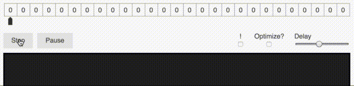

# BFC
BFC is a compiler for the esoteric language [BF](https://en.wikipedia.org/wiki/Brainfuck).

This is a personal project while in school.

###BF Overview

BF is a very simple esoteric language that consists of eight commands, an instruction pointer, an array of at least 30,000 bytes initialized to zero, and two streams of bytes for input and output.

All characters aside form the eight commands are ignored and will not affect the program.

When a BF program starts the pointer starts at the first block of the array.

#####Below are the eight commands:

```
>       Move the data pointer one cell to the right

<       Move the data pointer one cell to the left

+       Increment the value at the data pointer by one

-       Decrement the value at the data pointer by one

.       Output the byte at the data pointer

,       Take one byte of input, store the value at the data pointer

[       If byte at the data pointer is zero jump the data pointer to the command after the matching ']'

]       If the byte at the data pointer is nonzero jump the data pointer back to the command after the matching '['
```

#####Read and Write
Since the array only stores integer values, when writing a byte with `.` the integer is converted to its ASCII character. These associations can be seen in this [table](http://www.asciitable.com/) in the 'Html' column.

For example writing the value 65 will result in an 'A' being printed.

When reading a byte with `,` the character is converted to its ASCII value and stored at the data pointer. Single digit integers are stored as themselves.

#####Example
This program prints "Hello World!".

`++++++++++[>+++++++>++++++++++>+++>+<<<<-]>++.>+.+++++++..+++.>++.<<+++++++++++++++.>.+++.------.--------.>+.>.`

Here is a gif of it running (you can see the array being updated).


